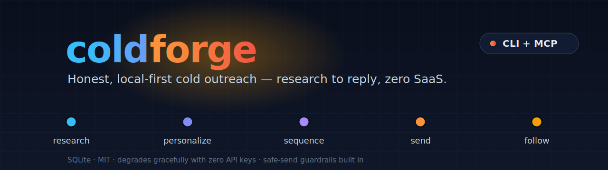

<p align="center">
  
</p>

<p align="center">
  <a href="https://github.com/Makeph/coldforge/actions/workflows/ci.yml"></a>
  
  
  <a href="LICENSE"></a>
</p>

# coldforge

**Honest, local-first cold outreach.** Research a prospect → personalize the
opener → run a safe, sequenced campaign → auto-follow-up only the people who
didn't reply. One shared Python core, two front-ends: a **CLI** and an **MCP
server** you can drive from Claude.

No SaaS, no account, no required API keys. Your prospect data and your `.env`
never leave your machine — it's a single SQLite file you can delete and rebuild.

```bash
git clone https://github.com/Makeph/coldforge && cd coldforge
pip install -e ".[all]"            # or `pip install -e .` for the zero-dep core
coldforge init
coldforge leads import examples/leads.csv
coldforge research --all
coldforge campaign create --name q3 --sequence examples/sequence.yml
coldforge campaign activate q3 --leads examples/leads.csv
coldforge campaign preview q3      # review the whole timeline first
coldforge tick --dry-run           # see exactly what would send
```

> Not on PyPI yet — install from source as above. (`pip install coldforge`
> will be the one-liner once it's published.)

---

## Why this exists

It's a synthesis of the best ideas from a pile of open-source outreach tools,
rebuilt small and honest:

| Idea | Borrowed from | How coldforge does it |
|------|---------------|------------------------|
| Local SQLite sending engine, sequences, A/B, safe `tick` worker | `cold-cli` (Go) | Re-implemented lean in Python |
| Web-search + scrape to personalize | `prospect-research-mcp` | `research` command + `research_prospect` MCP tool, zero-key DuckDuckGo fallback |
| LLM-personalized emails | `ProspectAI` | ~150 lines, not 137k; **always** degrades to template fill |
| Curated reply-driving templates, silent-reply follow-up, SPF/DKIM/DMARC check | `coldflow` | Original template pack + `doctor` + reply→cancel rule |

Everything **degrades gracefully**: no Anthropic key → deterministic template
fill; no Tavily key → DuckDuckGo + site scrape; no SMTP → dry-run only. You can
run the entire pipeline end-to-end with an empty `.env`.

## Two front-ends, one core

```
            ┌──────────────────────────────────────────────┐
            │  shared core (research · personalize ·        │
            │  templates · sequence · sender · db)          │
            └───────────────┬───────────────┬──────────────┘
                            │               │
                      coldforge CLI     MCP server
                  research→send→follow   research_prospect
                                         draft_email
```

### CLI

```bash
coldforge templates list                 # browse the pack
coldforge templates show sales_pain_point
coldforge research alex@acme.io          # store a personalization signal
coldforge draft -l alex@acme.io -t sales_pain_point --research
coldforge doctor acme.io                 # SPF / DKIM / DMARC, 0–100 score
coldforge reply mark alex@acme.io        # records a reply → cancels follow-ups
coldforge stats q3
```

### MCP (drive it from Claude)

```bash
pip install "coldforge[mcp]"
coldforge mcp        # stdio server
```

Register it with any MCP client (e.g. Claude Desktop / Claude Code):

```json
{
  "mcpServers": {
    "coldforge": { "command": "coldforge", "args": ["mcp"] }
  }
}
```

Tools exposed: `research_prospect`, `draft_email`, `list_templates`,
`show_template`, `check_deliverability`. Now you can ask Claude *"research Alex
at Acme and draft a pain-point cold email"* and it uses the same engine the CLI
does.

## Sequences

A sequence is a list of steps in YAML:

```yaml
- template: sales_pain_point   # concrete opener from the lead's data + research
  wait_days: 0
  condition: always
- template: followup_bump      # one soft bump, same thread, only if no reply
  wait_days: 3
  condition: no_reply
```

On `activate`, every step is pre-scheduled for every lead. The `tick` worker
(run it from cron / Task Scheduler) sends what's due **and** enforces the
guardrails:

- **Send window & days** — nothing sends outside `COLDFORGE_SEND_WINDOW` /
  `COLDFORGE_SEND_DAYS` (default 09:00–17:00, Mon–Fri).
- **Daily cap** — `COLDFORGE_DAILY_LIMIT` (default 40) per account.
- **Jittered pacing** — randomised gap between real sends.
- **Reply → cancel** — a `no_reply` step is skipped and the rest of that lead's
  sequence canceled the moment a reply is recorded (manually or via IMAP).

```bash
# typical cron line — runs the worker every 15 min during the day
*/15 9-17 * * 1-5  coldforge tick --scan-replies
```

## Configuration

Everything is optional — copy `.env.example` to `.env` and fill what you need.

| Variable | Purpose | Without it |
|----------|---------|------------|
| `ANTHROPIC_API_KEY` | Claude-personalized drafts | deterministic template fill |
| `TAVILY_API_KEY` | high-quality research | DuckDuckGo + site scrape |
| `SMTP_*`, `COLDFORGE_FROM_*` | actually send mail | dry-run only |
| `IMAP_*` | auto-detect replies | mark replies manually |
| `COLDFORGE_DAILY_LIMIT` / `SEND_WINDOW` / `SEND_DAYS` | guardrails | sane defaults |

## Templates

Nine curated, plaintext, reply-tested templates across **sales, recruiting,
partnership, warm-intro, networking, follow-up** — each under ~120 words with
one CTA and deliverability notes baked into the front-matter. Add your own by
dropping a `.md` file into `~/.coldforge/templates/`.

## Install from source

```bash
git clone https://github.com/Makeph/coldforge
cd coldforge
pip install -e ".[dev]"
pytest          # offline test suite, no keys needed
```

## Responsible use

coldforge is a precision tool, not a spam cannon: low daily caps, send windows,
one-bump follow-ups, an explicit "say no and I'll stop" CTA in the templates,
and a `doctor` check so you authenticate your domain before sending. Only email
people you have a legitimate reason to contact, honour unsubscribes, and follow
the law that applies to you (CAN-SPAM, GDPR, etc.).

## License

MIT © 2026 Aurore Biakou
