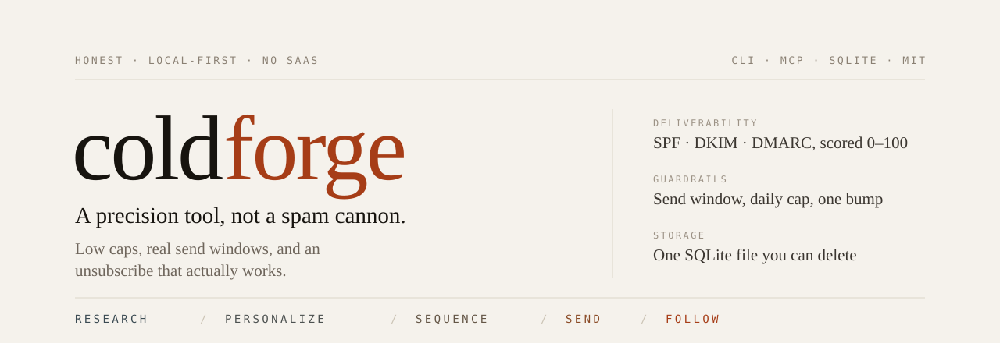

<p align="center">
  
</p>

<p align="center">
  <a href="https://github.com/Makeph/coldforge/actions/workflows/ci.yml"></a>
  
  
  
  <a href="LICENSE"></a>
</p>

---

Cold outreach tools want an account, a seat price, and your prospect list on
their servers. coldforge wants a directory. It researches a prospect,
personalizes the opener, schedules a sequenced campaign, and follows up only
with the people who didn't reply — from your terminal, or from any MCP client.

Your leads, your copy and your `.env` live in one SQLite file you can delete.
**Every API key is optional**: with none set, the whole pipeline still runs
end-to-end on deterministic fallbacks.

## See it run

```console
$ coldforge leads import examples/leads.csv
✓ Imported / updated 3 leads.

$ coldforge campaign create --name q3 --sequence examples/sequence.yml
✓ Created campaign q3 (2 steps).

$ coldforge campaign activate q3 --leads examples/leads.csv
✓ Activated q3: scheduled 6 messages for 3 leads.

$ coldforge campaign preview q3
                                                q3 · active
┌──────────────────┬──────┬──────────────────┬────────────────────────────────────────────────┬───────────┐
│ when             │ step │ to               │ subject                                        │ status    │
├──────────────────┼──────┼──────────────────┼────────────────────────────────────────────────┼───────────┤
│ 2026-07-28 09:00 │ 0    │ alex@acme.io     │ Acme + manual invoice reconciliation?          │ scheduled │
│ 2026-07-28 09:00 │ 0    │ sam@northwind.co │ Northwind + support tickets piling up          │ scheduled │
│                  │      │                  │ overnight?                                     │           │
│ 2026-07-28 09:00 │ 0    │ jordan@vela.app  │ Vela + flaky CI eating release windows?        │ scheduled │
│ 2026-07-31 09:00 │ 1    │ alex@acme.io     │ Re: {{original_subject}}                       │ scheduled │
│ 2026-07-31 09:00 │ 1    │ sam@northwind.co │ Re: {{original_subject}}                       │ scheduled │
│ 2026-07-31 09:00 │ 1    │ jordan@vela.app  │ Re: {{original_subject}}                       │ scheduled │
└──────────────────┴──────┴──────────────────┴────────────────────────────────────────────────┴───────────┘
```

Nothing has left your machine yet. The whole campaign is visible *before* the
first send, and `coldforge tick --dry-run` shows exactly what would go out.

The tooling argues with you, too — `lint` reads the copy the way a spam filter
would and refuses to bless a draft you haven't finished:

```console
$ coldforge lint -l alex@acme.io -t sales_pain_point
✗ unfilled {{variables}} left in the email
Score: 65/100 — rewrite before sending
```

## Install

```bash
git clone https://github.com/Makeph/coldforge && cd coldforge
pip install -e ".[all]"      # or `pip install -e .` for the zero-dependency core
coldforge init
```

> Not on PyPI yet — install from source. (`pip install coldforge` will be the
> one-liner once it's published.)

Python ≥ 3.10. Works on Windows, macOS and Linux. `pytest` runs the whole
offline suite with no keys and no network.

## Guardrails, not throttles

The difference between outreach and spam is mostly restraint, so the restraint
is built into the engine rather than left to your discipline. `tick` — run it
from cron or Task Scheduler — sends what's due and enforces:

| Guardrail | Behaviour |
|---|---|
| **Send window & days** | Nothing sends outside `COLDFORGE_SEND_WINDOW` / `SEND_DAYS` (default 09:00–17:00, Mon–Fri). |
| **Daily cap** | `COLDFORGE_DAILY_LIMIT` per account, default 40. The rest waits. |
| **Jittered pacing** | Randomised gaps between real sends — no metronome signature. |
| **Reply → cancel** | One reply cancels that lead's entire remaining sequence, instantly. |
| **Suppression list** | `suppress add`, or any reply classified as an unsubscribe, removes an address from every current and future campaign. Every real send carries `List-Unsubscribe`. |
| **Verification gate** | Addresses `leads verify` marked invalid are never scheduled and never sent to. |
| **Domain check** | `coldforge doctor acme.io` scores SPF / DKIM / DMARC 0–100 before you touch a lead. |

```bash
# typical cron line — the worker runs every 15 min during the day
*/15 9-17 * * 1-5  coldforge tick --scan-replies
```

## Two front-ends, one core

```
            ┌──────────────────────────────────────────────┐
            │  shared core (research · personalize ·        │
            │  templates · sequence · sender · db)          │
            └───────────────┬───────────────┬──────────────┘
                            │               │
                      coldforge CLI     MCP server
                  research→send→follow   research_prospect
                                         draft_email
```

### CLI

```bash
coldforge icp build --site acme.io       # read YOUR site → who buys it (editable JSON)
coldforge leads verify                   # syntax / disposable / MX — invalid never sends
coldforge leads score                    # rank every lead 0–100 against the ICP
coldforge templates list                 # browse the pack
coldforge research alex@acme.io          # store a personalization signal
coldforge draft -l alex@acme.io -t sales_pain_point --research
coldforge lint -l alex@acme.io -t sales_pain_point   # spam-filter check the copy
coldforge doctor acme.io                 # SPF / DKIM / DMARC, 0–100
coldforge reply mark alex@acme.io --text "pas intéressé"   # auto-classified
coldforge suppress add cto@acme.io       # do-not-contact list, honoured everywhere
coldforge stats q3 --by template         # which copy earns replies → double down
coldforge geo check --query "best CRM for real estate agents" --brand acme
coldforge content plan                   # ICP keyword gaps → numbered article briefs
```

### MCP

```bash
pip install "coldforge[mcp]"
coldforge mcp        # stdio server
```

```json
{
  "mcpServers": {
    "coldforge": { "command": "coldforge", "args": ["mcp"] }
  }
}
```

Twelve tools: `research_prospect`, `draft_email`, `list_templates`,
`show_template`, `check_deliverability`, `build_icp`, `score_prospect`,
`lint_email`, `classify_reply`, `geo_check_visibility`, `plan_content`,
`draft_article`. Ask your assistant *"research Alex at Acme and draft a
pain-point cold email"* and it drives the same engine the CLI does.

## Sequences

A sequence is a list of steps in YAML:

```yaml
- template: sales_pain_point   # concrete opener from the lead's data + research
  wait_days: 0
  condition: always
- template: followup_bump      # one soft bump, same thread, only if no reply
  wait_days: 3
  condition: no_reply
```

On `activate`, every step is pre-scheduled for every lead — which is why the
whole timeline is inspectable before anything sends.

## Target the right people

The AutoGTM idea — *"drop your site, learn who buys it"* — reduced to its
honest core, running on your machine:

```bash
coldforge icp build --site acme.io          # scrape your own site → ICP
coldforge leads score                       # every lead scored 0–100 + why
coldforge leads list                        # ranked, best fit first
```

The ICP is a plain JSON file (`~/.coldforge/icp.json`) holding the product
summary, the pains it removes, ranked buyer segments and match keywords — the
model proposes, you edit. With `ANTHROPIC_API_KEY` set an LLM writes the profile
and judges each lead; without it a deterministic keyword heuristic keeps ranking
usable offline.

## Visibility on answer engines

BabyLoveGrowth sells "get on Google and ChatGPT's radar" as a black-box
dashboard: it writes articles, builds backlinks, and tracks whether you're
mentioned when someone asks an AI. coldforge takes only the two pieces that port
honestly to a local, keyless-by-default tool — and skips the backlink network,
which can't be faked:

```bash
coldforge icp build --site acme.io       # with a key, also derives content_gaps:
                                         #   topics your buyers search for that
                                         #   your own site doesn't visibly answer
coldforge content plan                   # cluster keywords/gaps → article briefs
coldforge content draft 01-...           # write one (LLM if a key is set, else an outline)
coldforge geo check -q "best CRM for real estate agents" -b acme
```

`geo check` degrades per engine, independently: set none, one, or all four of
`ANTHROPIC_API_KEY` / `OPENAI_API_KEY` / `PERPLEXITY_API_KEY` / `GEMINI_API_KEY`;
each configured engine gets asked, the rest are skipped. Pass `--lead` to save
the result as a research signal — *"you don't show up when I ask ChatGPT about
X"* is a genuinely concrete cold-email opener.

## Reply triage

Replies aren't binary. Each one (IMAP scan or `reply mark --text "…"`) is
classified — **interested · not_interested · unsubscribe · ooo · other** — in
French and English. Unsubscribes hit the suppression list instantly; `stats`
shows the category breakdown, and `stats --by template` tells you which copy
actually earns replies, so you double down and retire the rest.

## Templates

Twelve curated, plaintext, reply-tested templates across **sales, sales-fr,
recruiting, partnership, warm-intro, networking, follow-up** — each under ~120
words, one CTA, with deliverability notes in the front-matter. The `sales-fr`
pack is a three-touch French sequence for selling to agencies (opener → soft
bump → breakup, see `examples/sequence_fr.yml`) with CNIL-style B2B compliance
notes. Add your own by dropping a `.md` file into `~/.coldforge/templates/`.

## Configuration

Everything is optional — copy `.env.example` to `.env` and fill what you need.

| Variable | Buys you | Without it |
|---|---|---|
| `ANTHROPIC_API_KEY` | LLM-personalized drafts, `content_gaps` in the ICP | deterministic template fill |
| `TAVILY_API_KEY` | higher-quality research | DuckDuckGo + site scrape |
| `SMTP_*`, `COLDFORGE_FROM_*` | actually send mail | dry-run only |
| `IMAP_*` | auto-detect replies | mark replies manually |
| `COLDFORGE_DAILY_LIMIT` / `SEND_WINDOW` / `SEND_DAYS` | tuned guardrails | sane defaults |
| `OPENAI_API_KEY` / `PERPLEXITY_API_KEY` / `GEMINI_API_KEY` | more engines in `geo check` | that engine is skipped |

## Why this exists

A synthesis of the best ideas from a pile of open-source outreach tools, rebuilt
small and honest:

| Idea | Borrowed from | How coldforge does it |
|---|---|---|
| Local SQLite sending engine, sequences, A/B, safe `tick` worker | `cold-cli` (Go) | re-implemented lean in Python |
| Web-search + scrape to personalize | `prospect-research-mcp` | `research` command + MCP tool, zero-key DuckDuckGo fallback |
| LLM-personalized emails | `ProspectAI` | ~150 lines, not 137k; **always** degrades to template fill |
| Curated templates, silent-reply follow-up, SPF/DKIM/DMARC check | `coldflow` | original template pack + `doctor` + reply→cancel |
| "Drop your site → learn who buys it", fit scoring, reply triage | AutoGTM tools (`explee.com` & co) | `icp build` + `leads score`, reply classification, `stats --by template` — local and editable |
| Answer-engine visibility, keyword-cluster → article generation | `babylovegrowth.ai` | `geo check` asks the engines directly; `content plan`/`draft` write the articles — no fake backlink network, no dashboard |

## Responsible use

coldforge is a precision tool, not a spam cannon: low daily caps, send windows,
one-bump follow-ups, an explicit "say no and I'll stop" CTA in the templates,
and a `doctor` check so you authenticate your domain before sending. Only email
people you have a legitimate reason to contact, honour unsubscribes, and follow
the law that applies to you (CAN-SPAM, GDPR, etc.).

## License

MIT © 2026 Makeph
